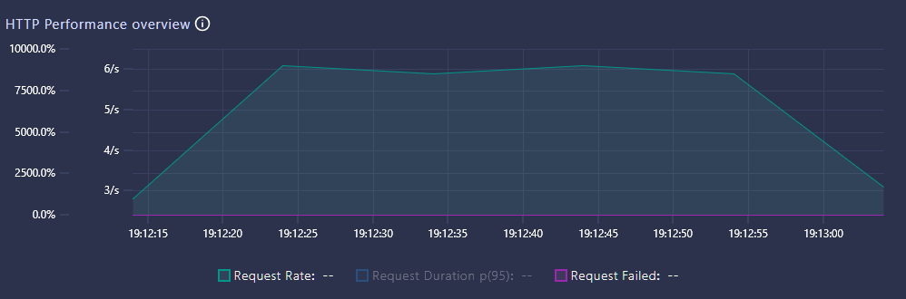

# Oppgave 2

1. Finn ut korleis testen kan visualiserast i sanntid med et "web dashboard"
1. Endre testen til å nytte "ramping-arrival-rate" slik at web-dashboard
ender opp med å sjå omlag slik ut med ei total køyretid på 1 minutt.

<!-- 
K6_WEB_DASHBOARD=true k6 run script.js
$env:K6_WEB_DASHBOARD="true"; k6 run script.js -->

